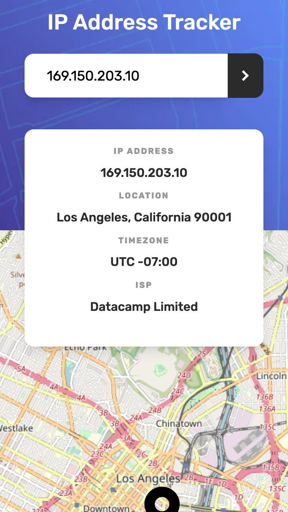

# Frontend Mentor - IP address tracker solution

This is a solution to the [IP address tracker challenge on Frontend Mentor](https://www.frontendmentor.io/challenges/ip-address-tracker-I8-0yYAH0). Frontend Mentor challenges help you improve your coding skills by building realistic projects. 

## Table of contents

- [Overview](#overview)
  - [The challenge](#the-challenge)
  - [Screenshot](#screenshot)
  - [Links](#links)
- [My process](#my-process)
  - [Built with](#built-with)
  - [What I learned](#what-i-learned)
  - [Continued development](#continued-development)
- [Author](#author)

## Overview

### The challenge

Users should be able to:

- View the optimal layout for each page depending on their device's screen size
- See hover states for all interactive elements on the page
- See their own IP address on the map on the initial page load
- Search for any IP addresses or domains and see the key information and location

### Screenshot

### Links

- Live Site URL: [IP Address Tracker](https://ip-address-tracker.io/)

## My process

### Built with

- Semantic HTML5 markup
- CSS custom properties
- Flexbox
- Mobile-first workflow
- [React](https://reactjs.org/) - JS library
- [@compiled/react](https://compiledcssinjs.com/) - Drop-in replacement for styled-components
- [Parcel](https://parceljs.org/) - JS bundler
- [ESlint](https://eslint.org/) - For linting
- [Jest](https://jestjs.io/) - For testing
- [Vercel](https://vercel.com/) - For hosting serverless edge function backend to query GeoIP API securely

### What I learned

After seeing many people choose to publically share their GeoIP API key, I was reminded of how important it was to make sure resources are well protected and secured behind a backend server. Therefore for this project, I chose to write a serverless edge function using my existing vercel account to complete this project. I learned a bit about improving initial response performance of my app utilizing dynamic lazy loading and suspense features and source map debugging for bundle bloat. I also learned and wrote a few basic test cases
to test out functionality of some of my components through DOM testing. I could not figure out a good way to test the map component
as it contains a graphical map but I will upload a test if I can think of one. I hope to start my next project with snapshot testing in mind as testing seems to make me re-think
how to organize my components better.

### Continued development

I am focusing on building tests, linting my code and optimizing my app by utilizing lighthouse. Aim to be more accurate with designs over time.

## Author

- Frontend Mentor - [@alexl8819](https://www.frontendmentor.io/profile/alexl8819)
