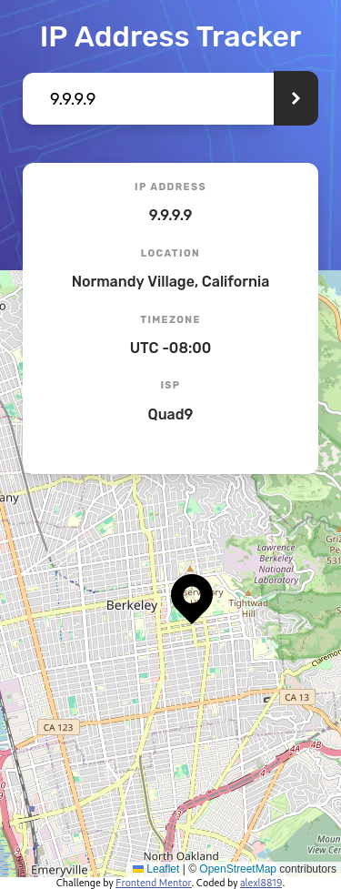

# Frontend Mentor - IP address tracker solution

This is a solution to the [IP address tracker challenge on Frontend Mentor](https://www.frontendmentor.io/challenges/ip-address-tracker-I8-0yYAH0). Frontend Mentor challenges help you improve your coding skills by building realistic projects. 

## Table of contents

- [Overview](#overview)
  - [The challenge](#the-challenge)
  - [Screenshot](#screenshot)
  - [Links](#links)
- [My process](#my-process)
  - [Built with](#built-with)
  - [What I learned](#what-i-learned)
  - [Continued development](#continued-development)
- [Author](#author)

## Overview

### The challenge

Users should be able to:

- View the optimal layout for each page depending on their device's screen size
- See hover states for all interactive elements on the page
- See their own IP address on the map on the initial page load
- Search for any IP addresses or domains and see the key information and location

### Screenshot

### Links

- Live Site URL: [IP Address Tracker](https://ip-address-tracker-eight-blush.vercel.app/)

## My process

### Built with

- Semantic HTML5 markup
- CSS custom properties
- Flexbox
- Mobile-first workflow
- [React](https://reactjs.org/) - JS library
- [@compiled/react](https://compiledcssinjs.com/) - Drop-in replacement for styled-components
- [Parcel](https://parceljs.org/) - JS bundler
- [ESlint](https://eslint.org/) - For linting
- [Jest](https://jestjs.io/) - For testing
- [Vercel](https://vercel.com/) - For hosting serverless edge function backend to query GeoIP API securely

### What I learned

Learned a bit about optimizing my app using lazy loading and source map debugging for bundle bloat. 

### Continued development

I am focusing on testing, linting and optimizing my app by utilizing lighthouse.

## Author

- Website - [slightlyfunctional.com](https://slightlyfunctional.com)
- Frontend Mentor - [@slightlyfunctional](https://www.frontendmentor.io/profile/slightlyfunctional)
